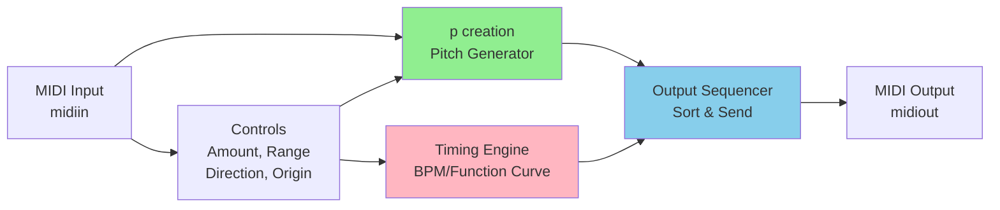

  

# Averager

A Max for Live MIDI device that generates random pitch sets whose average matches a target pitch, for computer-aided composition or live set ups. The device is inspired by the cognitive phenomenon that humans are remarkably accurate at identifying the average pitch within a series of random pitches.

## Features

**Pitch Averaging**: Generates random pitch sets that average to a specific target pitch (MIDI note number)  

**Real-time MIDI Output**: Outputs generated pitches in defined order and pace as MIDI notes for use in Ableton Live

### Controls

1. **Amount**: Number of pitches to output in each set
2. **Range**: Range above and below the average pitch (determines the spread of pitches)
3. **Origin average note**: Choose whether to play the average pitch at the beginning
   - **no-origin**: Skip the origin pitch
   - **w/origin**: Include the origin pitch first
4. **Playback Direction**: Control the order of pitch output
   - **Random**: Random order
   - **Down**: Descending order
   - **Up**: Ascending order
5. **BPM Controls**: 
   - **Fixed BPM**: Choose from preset values (2000ms or 500ms intervals)
   - **Custom Function**: Use a tempo envelope curve for dynamic timing
   - **Function Editor**: Draw custom BPM curves over the duration of the note sequence

## Usage

### Quickstart

1. Download and add `averager.amxd` to a MIDI track in Ableton Live
2. Set your target average pitch (incoming MIDI note or parameter)
3. Adjust Amount and Range to control the pitch set characteristics
4. Choose playback direction and origin mode
5. Set BPM timing (fixed or use the function curve)
6. Trigger to generate and play the pitch sequence

### Using the Function Curve
The function editor allows you to create dynamic tempo envelopes:
- **X-axis**: Position through the note sequence (automatically scaled to number of notes)
- **Y-axis**: BPM at that position (range: 50-350 BPM)
- The device interpolates linearly between breakpoints
- Real-time calculation ensures accurate timing through variable BPM changes

### Using as Standalone Max Patch (.maxpat)
1. Download `averager.maxpat`
3. Drag onto a MIDI track in Ableton Live
2. Open in Max/MSP (requires Max 8 or later)
3. Can be used independently or modified for your own needs

## Technical Details

### Technical Architecture

The device processes MIDI input through five main stages:

#### How It Works

**1. Pitch Generation (`p creation`)**
- Generates random pitch offsets within specified range
- Calculates their average and adjusts all pitches to match the target note
- Result: A balanced set that averages exactly to the input MIDI note

**2. Timing Engine**
- Fixed mode: 2000ms or 500ms intervals
- Function mode: Interpolates custom BPM curve at 1000x resolution for smooth tempo changes

**3. Output Sequencer**
- Sorts pitches by direction (Random/Up/Down)
- Sends notes one-by-one using `metro` and `zl.queue`
- Optionally plays origin note first

### Pitch Generation Algorithm

The algorithm generates a pitch set that mathematically averages to the target note:

1. **Generate**: Create N random pitches within ±Range semitones
2. **Calculate**: Find the average of the random set
3. **Adjust**: Shift all pitches by the difference to match target average

Result: Every pitch set has the exact same average while maintaining randomness and spread.

### Timing Engine

**Fixed BPM**: Choose 2000ms (30 BPM) or 500ms (120 BPM) intervals

**Function Curve**: Draw a tempo envelope that changes over the sequence
- Samples curve at 1000x resolution for smooth tempo changes
- Uses harmonic mean to ensure accurate timing perception
- Supports 30-500 BPM range

## Requirements

- Ableton Live 10 or later (for .amxd)
- Max for Live (included with Live Suite, or as separate add-on)
- Max/MSP 8 or later (for standalone .maxpat development)

## Files

- `averager.amxd` - Max for Live device (ready to use in Ableton)
- `averager.maxpat` - Standalone Max patch (for development/modification)

## Use Cases

- **Computer-Aided Composition**: Generate balanced pitch materials for acoustic or electronic works
- **Live Performance**: Real-time pitch generation with controllable parameters
- **Algorithmic Composition**: Create pitch sets with specific statistical properties
- **Pedagogical Tool**: Explore concepts of pitch averaging and balance in composition
- **Studio Production**: Generate MIDI content for further editing and orchestration

## License

MIT License - see [LICENSE](LICENSE) file for details

## Author

Gur Shafriri   
shafriri.gur@gmail.com
